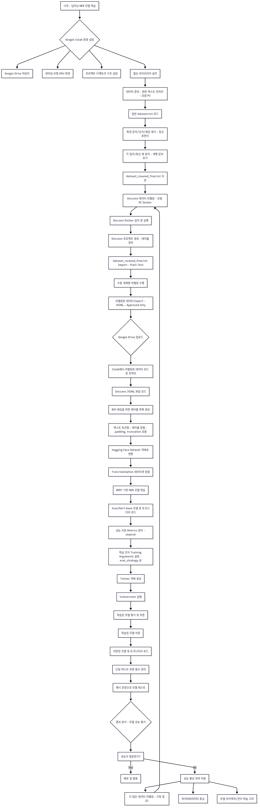

# 딥러닝 기반 법령해석 데이터 NER 모델 학습

이 프로젝트는 '소방시설법령 질의회신집'과 같은 비정형 텍스트에서 '질의'와 '회신' 쌍을 자동으로 추출하고 분류하기 위한 개체명 인식(Named Entity Recognition, NER) 모델을 구축하는 과정을 담고 있습니다.

## 1. 프로젝트 개요 및 동기

이 프로젝트는 회사에서 할당받은 **각 공공기관 중앙부처의 법령해석 데이터셋을 웹 크롤링하여 PDF 또는 HWP 파일 내의 질의와 회신을 한 세트로 파싱하고 검증**하는 업무를 효율적으로 해결하기 위해 시작되었습니다.

기존의 수작업 방식은 다음과 같은 문제점을 안고 있었습니다:

1.  **방대한 데이터 양:** 검증해야 할 질의-회신 세트가 **총 1만 2천 개**에 달해, 수작업으로는 엄청난 시간과 노력이 소요되었습니다.
2.  **정확성 검증의 어려움:** '질의 1'과 '회신 1'이 논리적으로 올바르게 연결되었는지, 그리고 질의와 회신의 개수가 일치하는지 등을 사람이 일일이 판단해야 했습니다.
3.  **특이사항 분류의 비효율성:** 회신 내용이 법령에 근거하지 않거나, 질의-회신 쌍이 맞지 않는 경우를 '특이사항'으로 분류하는 작업 역시 수동으로 진행되어 비효율적이었습니다.

컴퓨터 공학 전공자로서 이러한 비효율적인 반복 업무를 자동화하고, 그 과정에서 **딥러닝, 데이터 라벨링, Docker, 그리고 자연어 처리(NLP) 기술**을 실질적으로 배우고 적용하는 것을 목표로 삼았습니다. 이 리포지토리는 그 전체 과정에 대한 기록입니다.

## 2. 프로젝트 전체 워크플로우

### 플로우차트


### 단계별 요약
1.  **Google Colab 환경 설정**: 모델 학습을 위해 GPU 런타임을 설정하고 필요한 라이브러리를 설치합니다.
2.  **데이터 준비 (로컬)**: 원본 `dataset.txt`에서 불필요한 문자를 제거하고, Doccano에서 쉽게 처리할 수 있도록 각 질의/회신 쌍을 분리하는 전처리 작업을 수행합니다 (`preprocess_dataset.py`).
3.  **데이터 라벨링 (로컬 Docker)**: Docker를 이용해 로컬 환경에서 Doccano를 실행하고, 전처리된 텍스트 파일에 `QUESTION_ID`, `ANSWER_CONTENT` 등 개체명 레이블을 지정합니다.
4.  **데이터셋 변환 (Colab)**: 라벨링이 완료된 데이터를 `JSONL` 형식으로 내보내고, Colab에서 Hugging Face `Dataset` 객체로 변환합니다. 이 과정에서 토큰에 BIO 태그를 할당합니다.
5.  **NER 모델 학습 (Colab)**: 사전 학습된 `klue/bert-base` 모델을 기반으로, 라벨링된 데이터셋을 사용하여 토큰 분류(Token Classification) 모델을 파인튜닝합니다.
6.  **모델 평가 및 추론**: 학습된 모델의 성능(Precision, Recall, F1-score)을 평가하고, 새로운 텍스트에 대한 추론을 수행하여 결과를 확인합니다.

## 3. 사용법

### 요구사항
- Python 3.x
- Docker Desktop
- Google Colab (또는 GPU가 장착된 로컬 환경)

### 단계별 실행 가이드

1.  **데이터 전처리 (로컬)**
    - `preprocess_dataset.py` 스크립트를 실행하여 `dataset.txt` 파일을 클리닝합니다.
    ```bash
    python preprocess_dataset.py
    ```
    - 생성된 `dataset_cleaned_final.txt` 파일을 확인합니다.

2.  **데이터 라벨링 (로컬)**
    - Docker를 사용하여 Doccano를 실행합니다.
    ```bash
    # Doccano 이미지 다운로드
    docker pull doccano/doccano

    # Doccano 컨테이너 실행
    docker run -it -d --name doccano -p 8000:8000 -e ADMIN_USERNAME=admin -e ADMIN_PASSWORD=password -e ADMIN_EMAIL=admin@example.com doccano/doccano
    ```
    - 웹 브라우저에서 `http://localhost:8000`에 접속하여 로그인합니다.
    - 새 프로젝트를 생성하고, `dataset_cleaned_final.txt` 파일을 임포트하여 라벨링을 진행합니다.
    - 라벨링 완료 후, `JSONL` 형식으로 데이터를 내보냅니다.

3.  **모델 학습 및 평가 (Colab)**
    - **`deep_learning_final_v2.ipynb`** 노트북을 다운로드하여 Google Colab에서 엽니다.
    - **런타임 유형을 GPU로 변경**합니다.
    - Doccano에서 내보낸 `JSONL` 파일을 Google Drive에 업로드합니다.
    - 노트북의 셀을 순서대로 실행하여 데이터 로드, 전처리, 모델 학습 및 평가를 진행합니다.

> **모든 코드와 상세한 설명은 `deep_learning_final_v2.ipynb` 파일에 포함되어 있습니다. 전체 프로젝트를 이해하고 직접 실행해보려면 해당 파일을 Colab에서 열어보는 것을 강력히 권장합니다.**

## 4. 프로젝트 회고 및 배운 점

이번 프로젝트를 통해 딥러닝 모델을 실제 업무에 적용하는 전체 과정을 경험하며 많은 것을 배우고 느꼈습니다. 단순히 이론으로만 알던 개념들을 직접 부딪히고 해결하며 얻은 교훈들은 다음과 같습니다.

### 기술적 성장 및 경험

*   **클라우드 기반 GPU 활용의 필요성:** 딥러닝 모델 학습처럼 대규모 연산이 필요한 작업은 일반 로컬 PC 환경에서 수행하기 어렵다는 것을 체감했습니다. **Google Colab**이 제공하는 무료 **T4 GPU**는 이러한 제약을 극복하고, 비용 효율적으로 모델을 학습하고 실험할 수 있는 훌륭한 대안이었습니다.
*   **Docker와 컨테이너 환경 경험:** 데이터 라벨링 도구인 **Doccano**를 설치하고 실행하기 위해 **Docker**를 처음 사용해보았습니다. 이를 통해 애플리케이션을 격리된 환경에서 손쉽게 배포하고 실행하는 컨테이너 기술의 강력함을 이해하게 되었고, 복잡한 설치 과정 없이 필요한 도구를 빠르게 구축하는 경험을 쌓을 수 있었습니다.
*   **엔드-투-엔드(End-to-End) 파이프라인 구축:** 데이터 전처리부터 라벨링, 모델 학습, 평가, 그리고 추론에 이르기까지의 전체 머신러닝 파이프라인을 직접 설계하고 구축했습니다. 각 단계가 어떻게 유기적으로 연결되는지, 그리고 각 단계에서 어떤 점을 고려해야 하는지에 대한 실질적인 이해를 높일 수 있었습니다.

### 딥러닝 모델과 데이터에 대한 깊은 이해

*   **'Garbage In, Garbage Out'의 실감:** 모델의 성능은 결국 데이터의 양과 질에 의해 결정된다는 것을 뼈저리게 느꼈습니다. 특히, **라벨링된 데이터 샘플의 수가 많을수록 모델의 정확도가 비례하여 향상**되는 것을 직접 확인했습니다. 초기 단계에서 적은 수의 샘플로 학습했을 때 모델이 거의 작동하지 않았던 경험은 양질의 데이터 확보가 얼마나 중요한지 깨닫게 해주었습니다.
*   **사전 학습 모델(Pre-trained Model)의 위력:** `klue/bert-base`와 같은 사전 학습된 모델을 기반으로 파인튜닝하는 것이 왜 효율적인지를 이해했습니다. 밑바닥부터 모든 것을 학습시키는 대신, 이미 방대한 한국어 데이터를 학습한 모델을 활용함으로써 비교적 적은 데이터로도 특정 도메인의 작업을 수행할 수 있다는 전이 학습의 개념을 실제로 적용해볼 수 있었습니다.

### 현실적인 한계와 성과

*   **고품질 학습 데이터셋 구축의 어려움:** 지도 학습(Supervised Learning) 기반의 NER 모델을 훈련시키기 위해 1만 2천 개의 모든 데이터를 라벨링할 필요는 없습니다. 핵심은 모델이 전체 데이터의 패턴을 학습할 수 있을 만큼, **충분한 양의 대표적인 샘플들을 고품질로 라벨링**하는 것입니다. 일단 모델이 잘 학습되면, 나머지 라벨링되지 않은 데이터는 모델이 자동으로 처리해줄 수 있습니다. 하지만, 원하는 성능을 내기 위한 '충분한 양의 샘플'을 만드는 것 자체가 혼자서는 매우 힘든 작업이었습니다. 이로 인해 100% 완벽한 정확도를 가진 모델을 만들지는 못했지만, 지도 학습의 핵심 원리와 데이터의 중요성을 체감하는 계기가 되었습니다.
*   **그럼에도 불구하고, 성공적인 자동화:** 비록 모델이 완벽하지는 않았지만, 이 프로젝트를 통해 개발한 자동화된 파싱 시스템은 기존의 **수작업으로 질의-회신 쌍을 검증하던 방식에 비해 업무 효율을 압도적으로 향상**시켰습니다. 반복적인 작업을 자동화함으로써 시간을 절약하고, 더 중요한 분석 작업에 집중할 수 있게 되었다는 점에서 이 프로젝트는 매우 성공적이었습니다. 이는 '완벽함'을 추구하기보다 '개선'을 목표로 하는 것의 중요성을 일깨워 주었습니다.
